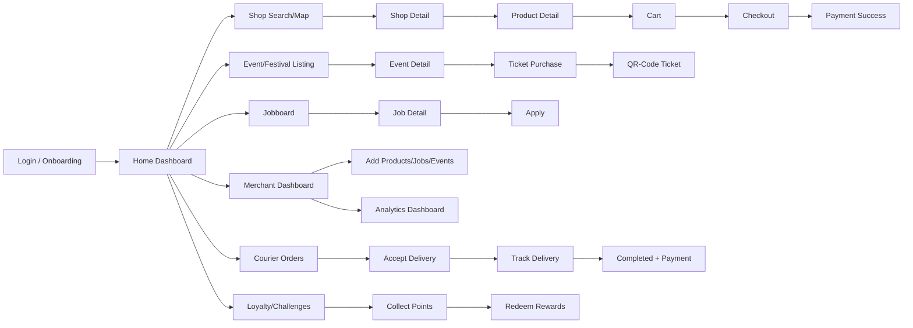

# Wireframe Screen Flow (docs/wireframe.md)

این سند مسیر صفحه‌به‌صفحه اپلیکیشن را برای پرسونای مختلف نمایش می‌دهد.

```mermaid
flowchart LR
    A[Login / Onboarding] --> B[Home Dashboard]
    
    %% Shopper
    B --> S1[Shop Search/Map]
    S1 --> S2[Shop Detail]
    S2 --> S3[Product Detail]
    S3 --> S4[Cart]
    S4 --> S5[Checkout]
    S5 --> S6[Payment Success]

    %% Event Visitor
    B --> E1[Event/Festival Listing]
    E1 --> E2[Event Detail]
    E2 --> E3[Ticket Purchase]
    E3 --> E4[QR-Code Ticket]

    %% Job Seeker
    B --> J1[Jobboard]
    J1 --> J2[Job Detail]
    J2 --> J3[Apply]

    %% Merchant
    B --> M1[Merchant Dashboard]
    M1 --> M2[Add Products/Jobs/Events]
    M1 --> M3[Analytics Dashboard]

    %% Courier
    B --> C1[Courier Orders]
    C1 --> C2[Accept Delivery]
    C2 --> C3[Track Delivery]
    C3 --> C4[Completed + Payment]

    %% Community
    B --> CU1[Loyalty/Challenges]
    CU1 --> CU2[Collect Points]
    CU2 --> CU3[Redeem Rewards]
```

